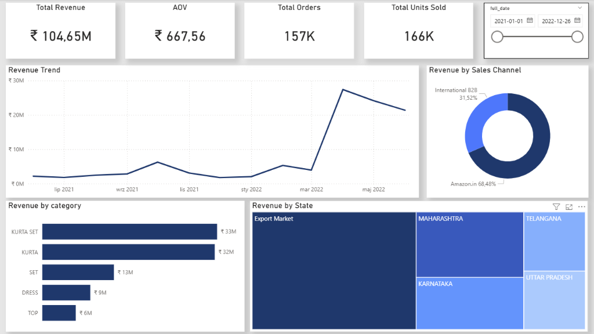
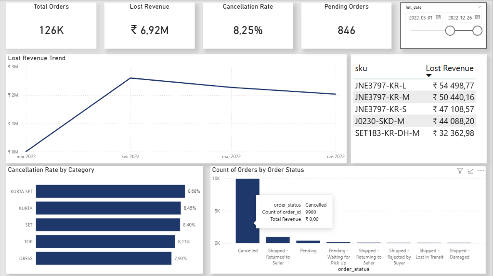
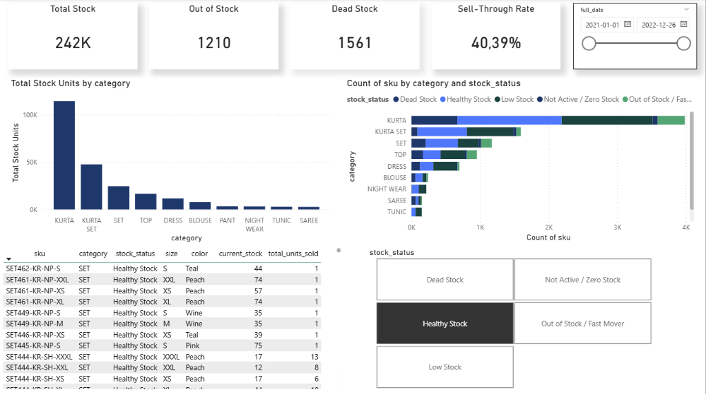

# E-Commerce Data Warehouse & BI Analytics

## 1. Project Overview & Business Problem
The company was operating in a highly fragmented data landscape. Sales data from Amazon (B2C) and international wholesale (B2B) were stored in disjointed formats along with unstructured inventory records. The lack of a centralized Single Source of Truth made it impossible to accurately track overall revenue, monitor fulfillment cancellation rates, or identify bloated inventory (frozen capital).

The goal of this project was to design and build an automated Data Warehouse and Business Intelligence reporting suite that unifies global sales channels, cleanses the data, and provides decision-makers with actionable insights to drive revenue growth, reduce logistics losses, and optimize warehouse space.

## 2. Architecture
The system is built on Microsoft SQL Server and follows the Medallion Architecture (Bronze, Silver, Gold), ensuring a scalable and evolutionary approach to data processing:

- Bronze Layer (Raw Data): Stores data in its original format. Used for bulk loading raw datasets.
- Silver Layer (Cleansed Data): Handles data cleansing, standardizing types, handling NULLs, trimming strings, and filtering out invalid records.
- Gold Layer (Business Data / Star Schema): The analytical layer designed specifically for Business Intelligence. It merges completely different business models (Amazon B2C and International B2B) into a single Fact table (fact_sales). It utilizes Surrogate Keys and a Default Unknown Member (-1) to ensure referential integrity. 

## 3. What Was Achieved
- Engineered a full-stack data platform unifying global sales channels and inventory.
- Implemented a robust ETL pipeline leading raw files into optimized analytical structures.
- Created a unified Star Schema with one central fact table and multiple dimension tables (Date, Product, Geography, Order Channel).
- Built denormalized SQL views (e.g., v_inventory_health, v_sales_performance) that push complex business logic upstream to the database layer, allowing BI tools to operate efficiently.

## 4. Key Logic & Business Conclusions
By deploying this platform, the business can now draw immediate conclusions and take action based on the following implemented logic:

- Inventory Optimization: Created logic to identify frozen capital by categorizing products into "Dead Stock" (stock > 0 but no sales), "Out of Stock / Fast Mover" (lost opportunity), and "Low Stock". 
- Logistics Accountability: Explicitly separated net revenue from lost revenue (due to cancellations/returns) in the Fact table. This allows operations to pinpoint exactly which product categories or regions suffer the highest return rates.
- Strategic Omnichannel View: Executives can compare B2B (Wholesale) and B2C (Amazon) margins and sales volumes side-by-side in a unified data model.

## 5. Power BI Dashboards
The final product of this data pipeline is a set of interactive Power BI dashboards that consume the Gold layer views. By pushing complex business logic upstream to the SQL database, the BI layer remains lightweight and highly performant. 

*(You can replace the placeholders below with actual screenshots of your dashboards)*

### ?? Executive Summary

Provides a high-level overview of growth, total revenue, and category performance, empowering leadership with immediate insights into overall business health.

### ?? Operations & Fulfillment

A deep-dive into logistics, explicitly tracking net revenue versus lost revenue (due to cancellations/returns). This allows operations to pinpoint exactly which product categories or regions suffer the highest return rates.

### ?? Inventory Health (Highlight)

This dashboard is designed with advanced Business Intelligence UX principles to make it strictly actionable for procurement and marketing teams:
- **Zero-DAX Logic**: Categorization of stock (Dead Stock, Out of Stock, Low Stock, Not Active / Zero Stock) is calculated directly in the SQL database, ensuring a Single Source of Truth.
- **Edge Case Handling**: The underlying SQL engine automatically traps "phantom SKUs" (products with 0 stock and 0 historical sales) into a dedicated Not Active / Zero Stock category so they do not artificially bloat the "Low Stock" metrics.
- **Advanced Drill-Down UX**: The dashboard utilizes interactive Slicers configured via custom visual interactions. Selecting a stock status instantly filters the detailed SKU table for action (e.g., liquidation), while intelligently leaving the high-level KPI cards untouched to preserve the global warehouse context.
